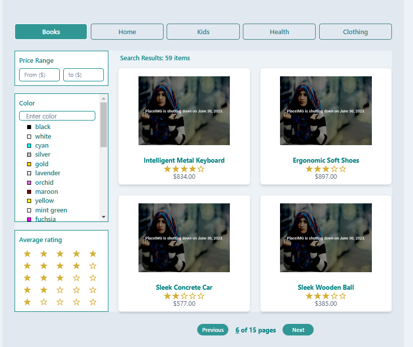

# An eCommerce web application using React for online shopping startup with filter products

In this project I designed a webpage StartUp app using React library to show a list of product (fetched from an api) and filtered using different criteria such as: category, color, price and/or rating.
The searched results are paginated and showed in a grid 2×2 (each page).
The filtered have differents logic, for instance: category and rating filters are enabled by clickable elements, color and price are accessed by typing in input elements that allow dinamically filter the products.

# Topics

    1. React Context
    2. Chakra
    3. Styled Components

# `screenShot`

